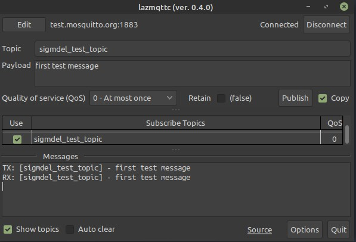
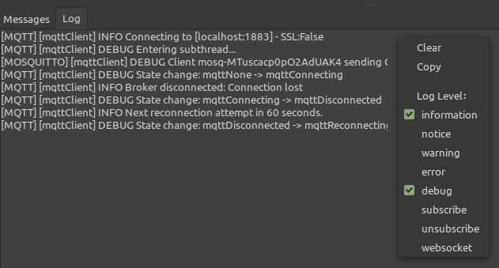

# lazmqttc: Lazarus MQTT Client
**Version 0.5.4**

A basic MQTT client written in Free Pascal/Lazarus that can publish messages to a broker while being subscribed to one or more topics with the same broker. It uses the [Eclipse mosquitto](https://mosquitto.org/) library to communicate with the MQTT broker. `lazmqttc` can be seen as the Eclipse utility `mosquitto_rr` with a graphical interface and some additional capabilities.



The screen capture shows the message sent to the public `test.moquitto.org` broker and it's reply. In this example, the client is subscribed to the same topic used to send the message, but there is no obligation of doing this. Indeed, the client can subscribe to many topics simultaneously which is its principal advantage over `mosquitto_rr`.

The source code of this project is made available with the understanding that users will compile it with a recent version the Free Pascal Compiler in the Lazarus IDE. Compilation should work with versions 2.0.12 or newer of Lazarus with Free Pascal 3.2.0 although it is recommended to use newer versions. The last tests were done with Lazarus 4.99 / FPC 3.3.1. It *may be possible* to test `lazmqttc` without compiling the source code using the binaries for Linux or Windows 10 found in the latest release.


<!-- TOC -->

- [1. Requirements for running the binaries](#1-requirements-for-running-the-binaries)
  - [1.1. Linux](#11-linux)
  - [1.2. Windows](#12-windows)
- [2. Requirements to compile the source code](#2-requirements-to-compile-the-source-code)
- [3. Compiling](#3-compiling)
- [4. Installation](#4-installation)
- [5. Program Options](#5-program-options)
  - [5.1. Automatic Connection Options](#51-automatic-connection-options)
  - [5.2. Messages Options](#52-messages-options)
  - [5.3. Default Broker](#53-default-broker)
  - [5.4. Option Overrides at Runtime](#54-option-overrides-at-runtime)
- [6. Broker Definitions](#6-broker-definitions)
  - [6.1. Security Warning](#61-security-warning)
- [7. Log](#7-log)
- [8. Improvements and Development](#8-improvements-and-development)
- [9. Recommendations](#9-recommendations)
- [10. Acknowledgment](#10-acknowledgment)
- [11. Licence](#11-licence)

<!-- /TOC -->

## 1. Requirements for running the binaries

A recent version of the Eclipse mosquitto library must be installed. There is no need to install the Mosquitto MQTT broker.

### 1.1. Linux

The *libmosquito* library is needed. In Debian systems this means installing the `libmosquitto1` package with a package manager such as [Synaptic](http://www.nongnu.org/synaptic/) or from the command line with `apt`.

```bash
$ sudo apt install libmosquitto1
```

### 1.2. Windows 

The needed `dll`s (`mosquitto.dll`, `mosquitto_dynamic_security.dll`, `libcrypto-1_1-x64.dll`, `libssl-1_1-x64.dll`, `mosquittopp.dll`) should be in the same directory containing the `lazmqttc.exe` executable. Versions 2.0.10 of these files are included in the `lazmqtt-0-5-4.zip` archive.


## 2. Requirements to compile the source code

Two Free Pascal units by [Károly Balogh (chainq)](https://github.com/chainq/mosquitto-p) are required. They are

- `mosquitto.pas` - conversion of the C `mosquitto.h` header to Pascal, provides the same API as the C version
- `mqttclass.pas` - Object Pascal wrapper class to ease the integration of libmosquitto into Object Oriented 

A slightly [modified version](mosquitto-p/README.md) is used and contained in the [mosquitto-p](mosquitto-p/) directory.

There is a further requirement in Linux: the `libmosquitto-dev` library. Install it with Synaptic or `apt` in Debian systems.

```bash
$ sudo apt install libmosquitto-dev
```

Of course to run the application once it is compiled, the *libmosquito* library is required as explained in the previous section.


## 3. Compiling

The repository is self-contained (except for the mosquitto library of course), so creating this tool should be straightforward. Clone the repository, start the Lazarus IDE, load the project, and compile. 

The project uses a custom component, a "virtual grid" to display subscribed topics. This component is so specialized that there is no point in adding it to the IDE component palette. Instead the component is created at runtime in the `FormCreate` methods of the main and broker edit forms. Consequently, the component is not visible in the form designer.

When compiling a final version, it would be advisable to heed the following advice.

1. Modify the default password encryption key 'DEFAULT_KEY' in the 'units/pwd.pas' file. That way it will not be easy for any one of the vast numbers of users of this application to read a broker definition file and obtain the MQTT broker password. See [5.1. Security Warning](#51-security-warning) for more details.

1. Add an application icon. Select `Load Icon` in `Project / Project Options` in the Lazarus IDE. The `lazmqttc.png` image the `images` directory can be used. The file `lazmqtt.lzp` is the [LazPaint](https://lazpaint.github.io/) source for the image file. 

2. Compile the release version. Select the `Release` build mode in `Project / Project Options / Compiler Options` in the Lazarus IDE. This will reduce the size of the executable by an order of magnitude.

## 4. Installation

The [installation](installation/) directory contains a `lazmqttc.desktop` file along with rudimentary instructions on how to install the utility in a Linux Mint MATE system. Presumably, installation in other Linux distributions would be more or less the same. 

Details about installation of an application in Windows 10 are unfortunately not provided.

The [README](res/README.md) in the [res](res/) directory explains where the default options configuration file and the example broker definition files must be stored in Linux or Windows 10.


The `languages` directory contains national language translations of the literal strings found in the program. This directory should be copied alongside the executable file.

Only a single translation into French is provided: `lazmqttc.fr.po`. However there is a template file, `lazmqttc.pot`, that can be used to create a translation into other languages.

The choice of language is done automatically based on the system locale when the program starts up. There is no provision for choosing the language at run-time. Those that prefer to use the English language version even if a translation into the national language exists can achieve their goal by renaming or erasing the `languages` directory.

## 5. Program Options

Modifying options (described next) has no immediate effect until the `Accept` button is pressed. In that case, the options editor will be immediately closed. The `Cancel` button will close the options editor after confirmation that modification will be lost is obtained. The `Reset` button will restore all options to their default values as defined in the `options.inc` file.

### 5.1. Automatic Connection Options

If automatic connection is enabled, then an attempt will be made to open a connection to the MQTT broker if one is not already established when a message is published. When such an attempt is made, the program will wait for the specified number of seconds and then publish the message if the connection has been established. Even if the program reports that it was unable to establish a connection, it is still possible that the broker will respond later. 

The public MQTT server at `mosquitto.org` may very well take more than the default 5 seconds to respond to an initial connection request. It was necessary to press the `Publish` button again once the connection was made to get the response shown in the screenshot at the top of this page.

### 5.2. Messages Options

If `Auto clear previous messages on publishing a message` is checked then the `Messages` control is cleared of old messages when a new message is published to the broker.

It is possible to define the maximum number of messages that can be shown in the `Messages` control. Older messages are removed as new messages come in if necessary.

If `Show published messages` is checked then published messages are added in the control no matter if the client is subscribed to these messages or not. In the screenshot the 

If `Show message topics` is not checked then only message payloads are shown in the `Messages` control. When shown, topics are enclosed in square brackets [&lt;*topic*&gt;].

The `Received message header` and the `Published message header` are used to define prefixes that identify which messages are sent and which are received.

### 5.3. Default Broker 

The `Default broker` field can be entered to set a broker definition file that will be loaded when the program starts.

### 5.4. Option Overrides at Runtime 

It is possible to override each of three messages options when the program is running.  

|Option override checkbox|Messages option|
|---|---|
|`Auto clear`|`Auto clear previous messages on publishing a message`|
|`Show`|`Show published messages`|
|`Show topics`|`Show message topics`|

A change in a runtime override does not affect the corresponding option in the configuration file, it only modifies the manner in which messages received from then on will be displayed. The default values in the options configuration file can only be changed in the `Options Editor` which is invoked with the *` Options `* button.

## 6. Broker Definitions 

MQTT broker definitions can be retrieved, saved, edited or created by clicking on the **` Edit `** button at the top of the main program window. Editing the current MQTT definition is the only way to add, remove or change the list of subscribed topics, but a double click anywhere in the Subscribe Topics grid, except in the `Use` column, is a shortcut to the `Subscribe Topics` tab  in the MQTT broker editor.


The **` Accept `** button must be clicked to use the broker definition in the editor. When the button is activated, the definition in the editor is compared with the broker definition in use by the application. If these two definitions are identical, then nothing happens. If they differ at all, any connection with a broker is closed even if the broker address is the same. That way, all previously subscribed topics are erased from the broker and the new list of topics will be subscribed when the connection with the broker is reestablished.

### 6.1. Security Warning

Prior to version 3.3, the MQTT broker passwords were stored in plain text in the broker definitions file. **Do not save MQTT broker passwords in the broker definition screen** in these older versions. 

A quick fix was added in version 3.3 so that an encrypted password will be saved in the broker definition file. A default encryption key is defined which should be changed if compiling the program (see [2. Compiling](#2-compiling) for details). However those using binary releases can override the default key by storing a different key in a file named `key.txt` in the directory that contains the broker definition files. The file should contain the key on one line and nothing else. Since this is a plain text file, this is not to be considered secured at all.

Note that the MQTT user and password are transmitted in plain text over an HTTP connection, so truly secure handling of the MQTT password will have to wait until communication with the broker using the HTTPS protocol is implemented.

## 7. Log

Application log messages produced by the `TMQTTConnection` object (defined in `mqttclass.pas` and the underlying Mosquitto library) can be viewed in the `Log` tab. The log level is set in the Log window context menu obtained with a right mouse button click.



Unlike the usual implementation, in Linux at least, setting a log level does not set all levels with higher priority. In other words, each level can be set or reset independently. It seems that some levels are not implemented. For example, no messages are generated when topics are changed when the `subscribe` and `unsubscribe` log levels are set.

## 8. Improvements and Development

Initially this utility was quickly cobbled to fulfill an immediate need: wrangling a number of IoT devices running Tasmota firmware mostly to get their IP address. Since then, an attempt has been made to combine the important features of the mosquitto "pub and sub clients" into a single application. At the same time, some attention has been given to cleaning up the code, but improvements are certainly possible. All suggestions welcome.

There are aspects of the MQTT protocol that are not implemented including the Last Will and Testament feature and clean sessions.

## 9. Recommendations

Many have recommended [mqtt-spy](https://github.com/eclipse-paho/paho.mqtt-spy) but its installation is not straightforward. On the other hand, [MQTT Explorer](https://mqtt-explorer.com/) by Thomas Nordquist is very powerful and its AppImage is easily installed.

## 10. Acknowledgment

Obviously, this utility would not have been possible without 

- the [Free Pascal](https://www.freepascal.org/) and the [Lazarus Ide](https://www.lazarus-ide.org/) projects
- the [Eclipse Mosquitto](https://github.com/eclipse/mosquitto) project and 
- the [mosquitto-p](https://github.com/chainq/mosquitto-p) project by Károly Balogh (chainq).

Not quite as obvious, the JSON data viewer by Michael Van Canneyt (named `jsonviewer`) provided the code for saving and loading the JSON broker definition and the JSON program option files. The utility can be found in the `tools` directory in the Lazarus source. The full path is `/usr/share/lazarus/2.0.12/tools/jsonviewer` in a default installation of Lazarus in Mint 20.1.

The broker password encryption using the <span class="tm">Free Pascal</span> Blowfish unit is based on a blog post by leledumbo [Blowfish, the cryptography unit by leledumbo](http://pascalgeek.blogspot.com/2012/06/encryption-decryption-and-asynchronous.html) (June 24, 2012).

## 11. Licence

The [Eclipse Mosquitto](https://github.com/eclipse/mosquitto) project is dual-licensed under the Eclipse Public License 2.0 and the
Eclipse Distribution License 1.0.

The content of the `mosquito-p` repository is covered by the ISC License ([SPDX](https://spdx.dev/): [ISC](https://spdx.org/licenses/ISC.html)).

Except for `eye.png` and `no_eye.png`, the icons used in the broker editor form were copied from the [Lazarus](https://www.lazarus-ide.org/) distribution which is provided under a modified LGPL licence (see COPYING.modifiedLGPL.txt in the Lazarus source tree. The source of the check list box editor (also covered by the modified LGPL licence) in the Lazarus IDE was the initial inspiration for the subscribed topics editor. 

The **BSD Zero Clause** ([SPDX](https://spdx.dev/): [0BSD](https://spdx.org/licenses/0BSD.html)) licence applies to the original code in this repository.
