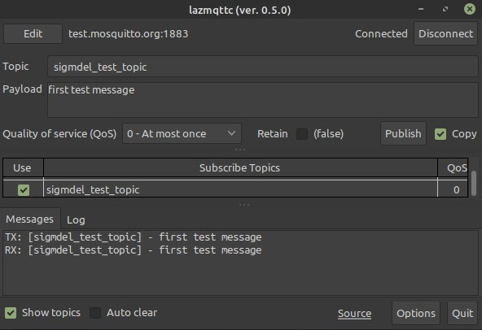

# lazmqttc: Lazarus MQTT Client

A basic MQTT client written in Free Pascal/Lazarus that can publish messages to a broker while being subscribed to one or more topics with the same broker. It uses the [Eclipse mosquitto](https://mosquitto.org/) library to communicate with the MQTT broker.



The screen capture shows the message sent to the public `test.moquitto.org` broker and it's reply. In this example, the client is subscribed to the same topic used to send the message, which in many cases would not be done.

<!-- TOC -->

- [1. Requirements](#1-requirements)
    - [1.1. Linux](#11-linux)
    - [1.2. Windows 10](#12-windows-10)
- [2. Compiling](#2-compiling)
- [3. Testing](#3-testing)
- [4. Installation](#4-installation)
- [5. Broker Definitions](#5-broker-definitions)
    - [5.1. Security Warning](#51-security-warning)
- [6. National Language Support](#6-national-language-support)
- [7. Improvements and Development](#7-improvements-and-development)
- [8. Acknowledgment](#8-acknowledgment)
- [9. Licence](#9-licence)

<!-- /TOC -->


## 1. Requirements

Two Free Pascal units are required

- `mosquitto.pas` - conversion of the C `mosquitto.h` header to Pascal, provides the same API as the C version
- `mqttclass.pas` - Object Pascal wrapper class to ease the integration of libmosquitto into Object Oriented 

These files, found in the [mosquitto-p](mosquitto-p/) directory, are copied from the [GitHub repository](https://github.com/chainq/mosquitto-p) with the same name by Károly Balogh (chainq).

In addition the  [Eclipse mosquitto](https://mosquitto.org/) library must be installed on the system.


### 1.1. Linux

The libmosquito library is needed. In Debian systems this means installing two packages:
-  `libmosquitto1`
-  `libmosquitto-dev`

The first, `libmosquitto1` will probably already be installed if the mosquitto-clients package is available on the system. In Debian-based systems these packages can be installed with a package manager such as [Synaptic](http://www.nongnu.org/synaptic/) or from the command line.

    $ sudo apt install libmosquitto1 libmosquitto-dev

There is no requirement to install the mosquitto MQTT broker.

### 1.2. Windows 10


1. Get the latest binary package from [Eclipse mosquitto Download](https://mosquitto.org/download/). Version 2.0.10 is available as of May 5, 2021. Chose the appropriate 64-bit installer (`mosquitto-2.0.10-install-windows-x64.exe`) or 32-bit installer (`mosquitto-2.0.10-install-windows-x32.exe`). 

2. Click on the downloaded application to install the package. It is not necessary to install it as a service if an MQTT broker is not needed. 

> - The 64-bit package was installed in `C:\Program Files\mosquitto\`. 
> - The 32-bit package will probably go into `C:\Program Files (x86)\mosquitto\`.
 
 3. Test the `mosquitto_sub` and `mosquitto_pub` utilities from the command line using the host name or IP address of a reachable MQTT broker instead of &lt;<i>mqtt_broker</i>&gt;. 

<pre>
   C:\Users\michel>"c:\Program Files\mosquitto\mosquitto_sub" -h &lt;<i>mqtt_broker</i>&gt; -t "#"
</pre>

4. Copy the mosquitto libraries <pre>
        C:\Program Files\mosquitto\mosquitto.dll
        C:\Program Files\mosquitto\mosquitto_dynamic_security.dll
        C:\Program Files\mosquitto\libcrypto-1_1-x64.dll
        C:\Program Files\mosquitto\libssl-1_1-x64.dll
        C:\Program Files\mosquitto\mosquittopp.dll
</pre> to the same folder containing the compiled `lazmqttc.exe` executable. Depending on use, they may not all be necessary, but the first two are needed without doubt. 

>> It is left as an exercise for knowledgable Windows users to find a more elegant way of ensuring that the DLLs are found.

Ultimately, if a mosquitto MQTT broker is to be run on the system, it may make more sense to simply copy `lazmqttc.exe` into the `mosquitto` directory alongside the `mosquitto_pub.exe` and `mosquitto_sub.exe` utilities it emulates.

## 2. Compiling

The repository is self-contained (except for the mosquitto library of course), so creating this tool should be straightforward. Clone the repository, start the Lazarus IDE, load the project, and compile. 

The project uses a custom component, a "virtual grid" to display subscribed topics. This component is so specialized that there is no point in adding it to the IDE component palette. Instead the component is created at run-time in the `FormCreate` methods of the main and broker edit forms. Consequently, it is normal to not find the component in the form designer.

When compiling a final version, it would be advisable to heed the following advice.

1. Modify the default password encryption key 'DEFAULT_KEY' in the 'units/pwd.pas' file. That way it will not be easy for any one of the vast number of users of this application to read a broker definition file and obtain the MQTT broker password. See [5.1. Security Warning](#51-security-warning) for more details.

1. Add an application icon. Select `Load Icon` in `Project / Project Options` in the Lazarus IDE. The `lazmqttc.png` image the `images` directory can be used. The file `lazmqtt.lzp` is the [LazPaint](https://lazpaint.github.io/) source for the image file. 

2. Compile the release version. Select the `Release` build mode in `Project / Project Options / Compiler Options` in the Lazarus IDE. This will reduce the size of the executable by an order of magnitude.

## 3. Testing

The project was built with Lazarus 2.0.12 (Free Pascall 3.2.0) on a Mint 20.1 system with version 1.6.9-1 of the mosquitto libraries. 

A cursory test was done with the same compiler in Windows 10. 

There are unit tests of the `TBroker` class, but they may be out of date.

<b>Warning:</b> No testing of SSL encryption has been performed.

## 4. Installation

The [installation](installation/) directory contains a `lazmqttc.desktop` file along with rudimentary instructions on how to install the utility in a Mint 20.1 Mate system. Presumably, installation in other Linux distributions would be more or less the same. 

Details about installation of an application in Windows 10 are unfortunately not provided.

## 5. Broker Definitions 

MQTT broker definitions can be retrieved, saved, edited or created by clicking on the **` Edit `** button at the top of the main program window. Editing the current MQTT definition is the only way to add, remove or change the list of subscribed topics. 

In Linux, broker definition files are saved in the `~/.config/sigmdel/lazmqttc` where `~` is the user home directory. So fully expanded the directory is
<pre>  /home/&lt;<i>user</i>&gt;/.config/sigmdel/lazmqttc</pre>

In Windows 10, the files are saved in the local `AppData` folder :
<pre>  C:\Users\&lt;<i>user</i>&gt;\AppData\Local\sigmdel\lazmqttc</pre>

MQTT broker definitions are JSON formatted text files. As an example, here is a definition used with an MQTT broker running on a Raspberry Pi also hosting a [Domoticz](https://domoticz.com/) home automation server. By default, the client will subscribe to the `stat/+/STATUS5` topic only when it connects with the broker. When the default publish message is sent to the broker, all subscribed [Tasmota](https://github.com/tasmota) devices respond by sending a "status 5" message. This can be useful because that will display the IP address of each device.

<pre>
{
  "Host" : "192.168.1.22",
  "Port" : 1883,
  "User" : "",
  "Password" : "",
  "SSL" : false,
  "SSLCert" : "",
  "KeepAlives" : 60,
  "ReconnectDelay" : 10,
  "ReconnectBackoff" : true,
  "AutoReconnect" : true,
  "PubTopic" : "cmnd/tasmotas/status",
  "PubPayload" : "5",
  "PubQoS" : 0,
  "PubRetain" : false,
  "SubTopics" : [
    {
      "Topic" : "stat/+/STATUS5",
      "QoS" : 0,
      "Use" : true
    },
    {
      "Topic" : "tele/#",
      "QoS" : 0,
      "Use" : false
    },
    {
      "Topic" : "domoticz/in",
      "QoS" : 0,
      "Use" : false
    },
    {
      "Topic" : "domoticz/out",
      "QoS" : 0,
      "Use" : false
    }
  ]
}   
</pre>       


### 5.1. Security Warning

Prior to version 3.3, the MQTT broker passwords were stored in plain text in the broker definitions file. **Do not save MQTT broker passwords in the broker definition screen** in these older versions. 

A quick fix was added in version 3.3 so that an encrypted password will be saved in the broker definition file. A default encryption key is defined which should be changed if compiling the program (see [2. Compiling](#2-compiling) for details). However those using binary releases can override the default key by storing a different key in a file named `key.txt` in the directory that contains the broker definition files. The file should contain the key on one line and nothing else. Since this is a plain text file, this is not to be considered secured at all.

Note that the MQTT user and password are transmitted in plain text over an HTTP connection, so truly secure handling of the MQTT password will have to wait until communication with the broker using the HTTPS protocol is implemented.

## 6. National Language Support

The `languages` directory contains national language translations of the literal strings found in the program. This directory should be copied alongside the executable file.

Only a single translation into French is provided: `lazmqttc.fr.po`. However there is a template file, `lazmqttc.po`, that can be used to create a translation into other languages.

The choice of language is done automatically based on the system locale when the program starts up. There is no provision for choosing the language at run-time. Those that prefer to use the English language version even if a translation into the national language exists can achieve their goal by renaming or erasing the `languages` directory.

## 7. Improvements and Development

Initially this utility was quickly cobbled to fulfill an immediate need: wrangling a number of IoT devices running Tasmota firmware mostly to get their IP address. Since then, an attempt has been made to combine the important features of the mosquitto "pub and sub clients" into a single application. At the same time, some attention has been given to cleaning up the code, but improvements are certainly possible. All suggestions welcome.

There are aspects of the MQTT protocol that are not implemented including the Last Will and Testament feature and clean sessions.

Version 0.3.4 brings two changes:
  1. If the client is not connected to the MQTT broker when the ```Publish``` button is pressed, then it will attempt to connect. 
  2. Published messages can now be added to list of ```Messages``` window which now looks more like a "chat". The published messages have a "TX: " prefix, received messages have a "RX: " prefix. This behaviour is controlled by a ```Copy``` checkbox beside the ```Publish``` button.

Connection to a broker is asynchronous. If an attempt to connect to a broker is made after pushing on the publish button, then the application will wait at most 5 seconds for the connection. The automation connection, the connection delay, as well as the message prefixes are  currently defined as constants at the start of the implementation of ```main.pas```.

```  
// Move these to application options
  SubscribedMemoSize = 2500;    // maximum number of lines in subscribed memo
  AutoConnectOnPublish = true;  // connect to broker if needed when Publish is pressed
  AutoConnectDelay = 5000;      // five seconds
  PubMsgHeader = 'TX: ';        // start of published messages in Messages box
  RcvMsgHeader = 'RX: ';        // start of received messages in Messages box           
```  
The next improvement should be to add these options to an application configuration file and to add a form to edit them.

## 8. Acknowledgment

Obviously, this utility would not have been possible without 

- the [Free Pascal](https://www.freepascal.org/) and the [Lazarus Ide](https://www.lazarus-ide.org/) projects
- the [Eclipse Mosquitto](https://github.com/eclipse/mosquitto) project and 
- the [mosquitto-p](https://github.com/chainq/mosquitto-p) project by Károly Balogh (chainq).

Not quite as obvious, the JSON data viewer by Michael Van Canneyt (named `jsonviewer`) provided the code for saving and loading JSON broker definition files. The utility can be found in the `tools` directory in the Lazarus source. The full path is `/usr/share/lazarus/2.0.12/tools/jsonviewer` in a default installation of Lazarus in Mint 20.1.

The broker password encryption using the <span class="tm">Free Pascal</span> Blowfish unit is based on a blog post by leledumbo [Blowfish, the cryptography unit by leledumbo](http://pascalgeek.blogspot.com/2012/06/encryption-decryption-and-asynchronous.html) (June 24, 2012).

## 9. Licence

The [Eclipse Mosquitto](https://github.com/eclipse/mosquitto) project is dual-licensed under the Eclipse Public License 2.0 and the
Eclipse Distribution License 1.0.

The content of the `mosquito-p` repository is covered by the ISC License ([SPDX](https://spdx.dev/): [ISC](https://spdx.org/licenses/ISC.html)).

Except for `eye.png` and `no_eye.png`, the icons used in the broker editor form were copied from the [Lazarus](https://www.lazarus-ide.org/) distribution which is provided under a modified LGPL licence (see COPYING.modifiedLGPL.txt in the Lazarus source tree. The source of the check list box editor (also covered by the modified LGPL licence) in the Lazarus IDE was the initial inspiration for the subscribed topics editor. 

The **BSD Zero Clause** ([SPDX](https://spdx.dev/): [0BSD](https://spdx.org/licenses/0BSD.html)) licence applies to the original code in this repository.


<!-- KeepAlives

https://github.com/knolleary/pubsubclient/issues/239
Keepalive timeout for default MQTT Broker is 10s, pubsubclient is default set to 15s?

nestor@domo:~ $ man mosquitto.conf
... 
keepalive_interval seconds
           Set the number of seconds after which the bridge should send a ping
           if no other traffic has occurred. Defaults to 60. A minimum value
           of 5 seconds is allowed.

-->
